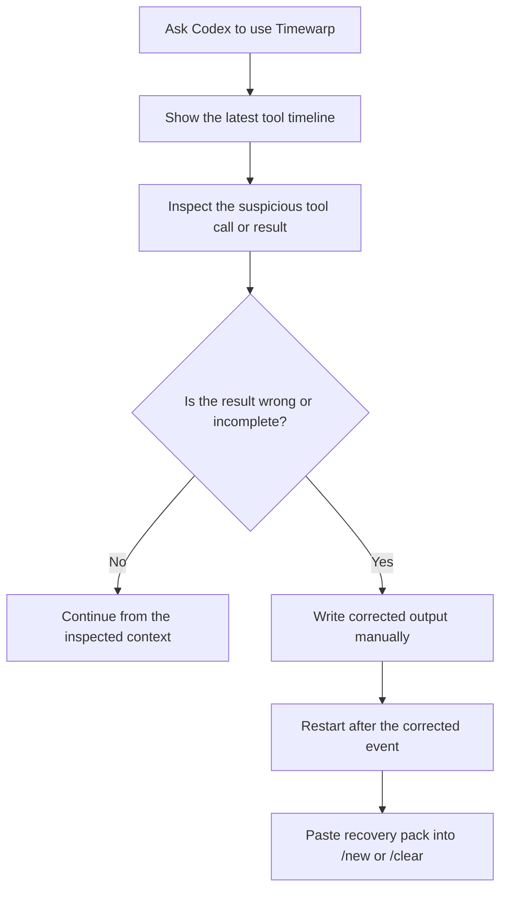
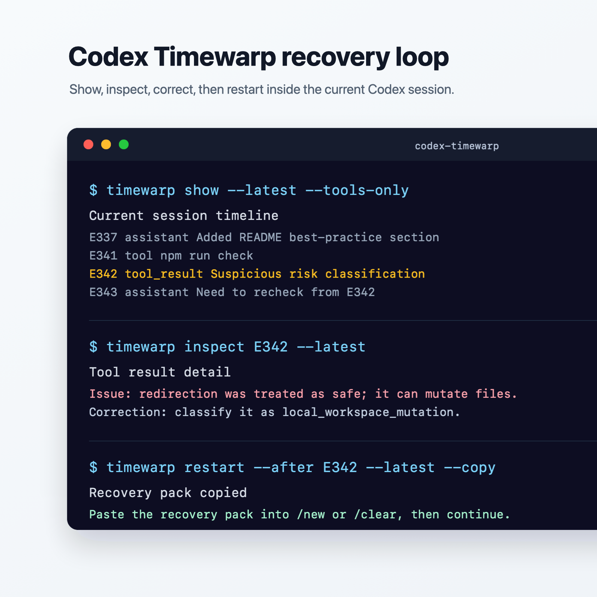

# Codex Timewarp

[English](./README.md) | [Simplified Chinese](./README.zh-CN.md)

Recover Codex runs from the exact bad prompt, assistant message, tool call, or tool result instead of restarting the whole task.

`codex-timewarp` is a Codex plugin marketplace repository for the `timewarp` plugin. It inspects local Codex session transcripts, helps you find the bad event, and generates clean-session recovery packs.

## Recommended Default Flow

If you want the default Timewarp experience inside Codex, start here:

Install the npm entrypoint, then let it register and install the Codex plugin:

```sh
npm install -g codex-timewarp
codex-timewarp install
```

Restart Codex so plugin skills and hooks are reloaded, then ask:

```text
Use timewarp to show the latest timeline and focus on tool-related events.
```

If you prefer not to install the npm entrypoint, run the Codex plugin commands directly:

```sh
codex plugin marketplace add git@github.com:pinksky13/codex-timewarp.git --ref main
codex plugin add timewarp@codex-timewarp
```

If the repository is public and your environment can clone from GitHub over HTTPS, both npm and direct install support the HTTPS shorthand:

```sh
codex-timewarp install --https
codex plugin marketplace add pinksky13/codex-timewarp --ref main
```

Do not clone this repository for normal use. Clone it only if you want to develop Timewarp or manually run the local CLI.

## A Simple Mental Model

Timewarp does not replace Codex.

It adds an inspection and recovery layer around Codex session transcripts:

- Codex runs the task and writes JSONL sessions.
- Timewarp reads the local session timeline.
- You inspect the exact prompt, assistant message, tool call, or tool result that went wrong.
- Timewarp generates a restart recovery pack for a clean Codex conversation or records a manual tool-result override.

Timewarp intentionally does not restore workspace files, rewrite original session files, or rerun mutating tools automatically.

## Start Here If You Are New

1. Install the plugin with the recommended flow above.
2. Restart Codex.
3. Ask Codex to use `timewarp` and show the latest tool-related timeline.
4. Inspect the suspicious event ID before choosing a recovery action.
5. Generate a `restart` recovery pack from before or after the chosen event.
6. Start `/new` or `/clear`, paste the whole pack, and continue from the selected boundary.

## What It Solves

Long agent runs often fail at one specific point:

- a prompt sent the run in the wrong direction
- the model chose the wrong tool
- a tool call used bad arguments
- a tool result was incomplete, stale, or misleading
- the model misread a tool result
- a later patch changed files you did not intend to change

Restarting the whole task wastes context and time. Timewarp lets you inspect the session timeline, locate the bad event, and generate a clean-session recovery pack from that exact boundary.

## Features

- Parse Codex JSONL sessions under `$CODEX_HOME/sessions` or `~/.codex/sessions`.
- Normalize transcript events into stable IDs like `E001`.
- Group events by user/task turn.
- Link tool calls to tool results by `call_id`.
- Inspect prompts, messages, tool calls, tool results, and patch events.
- Classify side-effect risk with machine-readable reasons: `read_only`, `local_workspace_mutation`, `external_side_effect`, or `unknown`.
- Prefer the current workspace when selecting `--latest`; warn when falling back to the global latest session.
- Generate richer `restart` recovery packs for clean Codex conversations, including full user intent and nearby tool context within a size budget.
- Keep `prompt` available as explicit soft recovery for the current session.
- Store manual tool-result override records under `$CODEX_HOME/timewarp/overrides/` and apply the latest matching override to `restart --after <event-id>` when no explicit replacement is supplied.

## Recommended Workflow

Installed plugin users can ask Codex to perform these Timewarp actions; local development users can run the same actions with `npm run timewarp -- ...`.

When used through the Codex skill, Codex should execute the requested `show`, `inspect`, or `restart` command directly when the event ID and selector are clear. It should not only print a command for you to run manually.

1. Run `show --latest --tools-only` to locate suspicious events. `--latest` prefers the current workspace; use `--cwd <path>` to choose another workspace explicitly.
2. Run `inspect <event-id>` on the suspected prompt, call, or result.
3. If the transcript should continue from a boundary, run `restart --before <event-id>` or `restart --after <event-id>`.
4. If a tool result was wrong or incomplete, pass `--replacement ...`, `--replacement-file <path>`, or `--stdin` to `restart`, or create an `override` record and run `restart --after <event-id>`.
5. Start a clean Codex conversation with `/new` or `/clear`, paste the whole recovery pack, and continue there.

## Development

Clone the repository only when you want to develop Timewarp or run the CLI by hand:

```sh
git clone git@github.com:pinksky13/codex-timewarp.git
cd codex-timewarp
npm run check
npm run timewarp -- show --latest --tools-only --limit 20
```

`npm run check` runs syntax checks and tests. `npm run timewarp -- show ...` shows recent tool-related events from the latest Codex session.

## Local CLI Reference

These commands are for a cloned checkout. Installed plugin users should usually ask Codex to use `timewarp` instead of running `npm` manually.

Show the latest timeline:

```sh
npm run timewarp -- show --latest --limit 30
```

Show the latest timeline for an explicit workspace:

```sh
npm run timewarp -- show --latest --cwd /path/to/repo --limit 30
```

Show only tool-related events:

```sh
npm run timewarp -- show --latest --tools-only --limit 30
```

Inspect one event:

```sh
npm run timewarp -- inspect E528 --latest
```

Generate a clean-session recovery pack from before a bad event:

```sh
npm run timewarp -- restart --before E528 --latest
```

Generate a clean-session recovery pack from after an event:

```sh
npm run timewarp -- restart --after E528 --latest
```

Generate a recovery pack with a corrected tool result and copy it when clipboard support is available:

```sh
npm run timewarp -- restart --after E529 --latest --replacement "Corrected tool output goes here." --copy
```

Generate a recovery pack using the latest matching override record:

```sh
npm run timewarp -- override E529 --latest --replacement "Corrected tool output goes here."
npm run timewarp -- restart --after E529 --latest
```

Generate a soft recovery prompt for the current session only when you explicitly accept polluted-session recovery:

```sh
npm run timewarp -- prompt --before E528 --latest
```

Write a manual tool-result override:

```sh
npm run timewarp -- override E529 --latest --replacement "Corrected tool output goes here."
```

Use JSON output for automation:

```sh
npm run timewarp -- show --latest --tools-only --json
npm run timewarp -- inspect E528 --latest --json
```

## Install Verification

To test installation without touching your real Codex config:

```sh
mkdir -p /tmp/timewarp-codex-home
CODEX_HOME=/tmp/timewarp-codex-home codex-timewarp install
CODEX_HOME=/tmp/timewarp-codex-home codex plugin list --marketplace codex-timewarp
```

## Best Practices

### Recovery Loop In Codex

Use Timewarp as an execution-path debugger for the current Codex session:





Inside Codex, prefer asking for the action directly:

```text
timewarp show latest tools-only
timewarp inspect E342
timewarp restart after E342 with replacement: <corrected result>
```

This lets Codex execute Timewarp for you: first reveal the current session's task path, then inspect the full tool-call result, then generate a clean-session restart pack from the corrected boundary.

- Prefer `inspect` before recovery. Do not recover from an event ID based only on a short preview.
- Treat `unknown` and `local_workspace_mutation` risk labels conservatively.
- Treat network reads such as `curl`, `git fetch`, and package metadata lookups as `unknown` unless inspection proves they are safe to repeat.
- Prefer `restart` for recovery, rewind, or clean continuation.
- Use `prompt` only when you explicitly accept soft recovery in the current session.
- Use `override` when you want plugin-owned override state; `restart --after` uses the latest matching override only when no explicit replacement is supplied.
- Keep replacement text short, factual, and specific.
- Do not use this MVP as proof that files were restored to an earlier state.
- Do not silently rerun mutating commands, deploys, pushes, posts, or email-sending commands.

## Safety Model

`restart`, `prompt`, and `fork` style recovery only generate text. They do not mutate Codex transcripts.

`restart` is the recommended hard recovery flow. Its pack is intended for a fresh `/new` or `/clear` conversation, not the old polluted session.

`override` writes synthetic override events to plugin-owned state:

```text
$CODEX_HOME/timewarp/overrides/<session_id>.jsonl
```

The original files under `~/.codex/sessions/**/rollout-*.jsonl` are never modified.

Installed hooks write the latest hook payload to:

```text
$CODEX_HOME/timewarp/hooks/last-hook.json
```

That hook file is diagnostic only. Hooks do not rewind sessions, create new conversations, mutate transcripts, or restore workspace files. Hook recording failures are reported as warnings and must not block core CLI recovery.

## MVP Limits

- No automatic workspace restore.
- No exact point-in-time file rollback.
- No automatic rerun of mutating tools.
- No native `/timewarp` slash command registration guarantee.
- No external side-effect rollback.

## Repository Layout

```text
.agents/plugins/marketplace.json
bin/codex-timewarp.js
package.json
README.md
README.zh-CN.md
plugins/timewarp/
  .codex-plugin/plugin.json
  skills/timewarp/SKILL.md
  bin/timewarp.ts
  hooks/hooks.json
  hooks/timewarp-hook.ts
  src/
  test/
```

The repository root is the marketplace root. `plugins/timewarp/` is the plugin root.

## License

MIT
